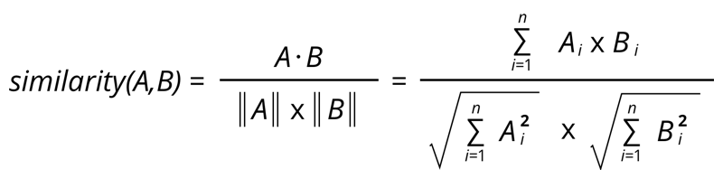
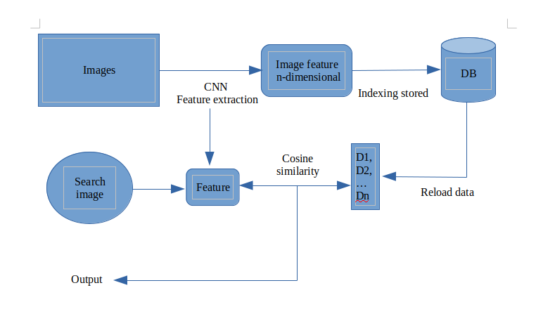

# Search Images By Image
Searching technique is always the popular topic for a lot of researchers. For solving the limitation when the request is not just text type but can be a real image, proposer wants to produce a new combination that using the strong power of CNN (convolutional layers) to extract image features and then calculate the similarity of input image and all features store in indexing file 

# CNN - VGG16
CNN (Convolutional Neural Network) is the special model for handling images data. It contains 2 parts: feature extraction and classification. By using feature extraction layer of CNN-VGG16 and skipping classification layer, the image can be extracted all valuable information.

  

 

# Cosine similarity
One of the best algorithm for comparing the similarity. Cosine similarity is a good choice to estimate the distance between 2 input vectors in the short time

  

# Algorithm architecture

  

