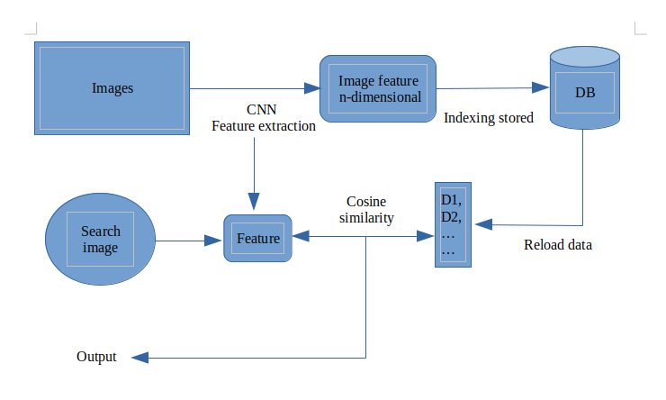

# Search Images By Image
To solve the limitation of the image type input search, the proposer wants to produce a new combination using the power of CNN (convolutional layers) to extract image features and then calculate the similarity of the input image and all features stored in indexing file.

# CNN - VGG16
CNN (Convolutional Neural Network) consists of feature extraction and classification. The power of the feature extraction layer of CNN (VGG16 model) is a popular choice when handling image data

  

 

# Cosine similarity
One of the best algorithm for comparing the similarity, cosine similarity shows its power for estimating the distance between 2 input vectors in a short time

  

# Algorithm architecture

  

